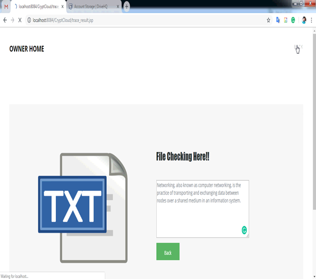

# INTRODUCTION

             Cloud computing is the use of computing resources (hardware and software) that are delivered as a service over a network (typically the Internet). The name comes from the common use of a cloud-shaped symbol as an abstraction for the complex infrastructure it contains in system diagrams. Cloud computing entrusts remote services with a user's data, software and computation. Cloud computing consists of hardware and software resources made available on the Internet as managed third-party services. These services typically provide access to advanced software applications and high-end networks of server computers.


## Structure of cloud computing

The goal of cloud computing is to apply traditional supercomputing, or high-performance computing power, normally used by military and research facilities, to perform tens of trillions of computations per second, in consumer-oriented applications such as financial portfolios, to deliver personalized information, to provide data storage or to power large, immersive computer games.
The cloud computing uses networks of large groups of servers typically running low-cost consumer PC technology with specialized connections to spread data-processing chores across them. This shared IT infrastructure contains large pools of systems that are linked together. Often, virtualization techniques are used to maximize the power of cloud computing.


### Characteristics and Services Models:

    The salient characteristics of cloud computing based on the definitions provided by the National Institute of Standards and Terminology (NIST) are outlined below:

    On-demand self-service: A consumer can unilaterally provision computing capabilities, such as server time and network storage, as needed automatically without requiring human interaction with each service’s provider.

    Broad network access: Capabilities are available over the network and accessed through standard mechanisms that promote use by heterogeneous thin or thick client platforms (e.g., mobile phones, laptops, and PDAs).

    Resource pooling: The provider’s computing resources are pooled to serve multiple consumers using a multi-tenant model, with different physical and virtual resources dynamically assigned and reassigned according to consumer demand. There is a sense of location-independence in that the customer generally has no control or knowledge over the exact location of the provided resources but may be able to specify location at a higher level of abstraction (e.g., country, state, or data center). Examples of resources include storage, processing, memory, network bandwidth, and virtual machines.

    Rapid elasticity: Capabilities can be rapidly and elastically provisioned, in some cases automatically, to quickly scale out and rapidly released to quickly scale in. To the consumer, the capabilities available for provisioning often appear to be unlimited and can be purchased in any quantity at any time.

    Measured service: Cloud systems automatically control and optimize resource use by leveraging a metering capability at some level of abstraction appropriate to the type of service (e.g., storage, processing, bandwidth, and active user accounts). Resource usage can be managed, controlled, and reported providing transparency for both the provider and consumer of the utilized service.

## Characteristics of cloud computing

### Services Models:

    Cloud Computing comprises three different service models, namely Infrastructure-as-a-Service (IaaS), Platform-as-a-Service (PaaS), and Software-as-a-Service (SaaS). The three service models or layer are completed by an end user layer that encapsulates the end user perspective on cloud services. The model is shown in figure below. If a cloud user accesses services on the infrastructure layer, for instance, she can run her own applications on the resources of a cloud infrastructure and remain responsible for the support, maintenance, and security of these applications herself. If she accesses a service on the application layer, these tasks are normally taken care of by the cloud service provider.


Structure of service models
Benefits of cloud computing:

1. Achieve economies of scale – increase volume output or productivity with fewer people. Your cost per unit, project or product plummets.
2. Reduce spending on technology infrastructure. Maintain easy access to your information with minimal upfront spending. Pay as you go (weekly, quarterly or yearly), based on demand.
3. Globalize your workforce on the cheap. People worldwide can access the cloud, provided they have an Internet connection.
4. Streamline processes. Get more work done in less time with less people.
5. Reduce capital costs. There’s no need to spend big money on hardware, software or licensing fees.
6. Improve accessibility. You have access anytime, anywhere, making your life so much easier!
7. Monitor projects more effectively. Stay within budget and ahead of completion cycle times.
8. Less personnel training is needed. It takes fewer people to do more work on a cloud, with a minimal learning curve on hardware and software issues.
9. Minimize licensing new software. Stretch and grow without the need to buy expensive software licenses or programs.
10. Improve flexibility. You can change direction without serious “people” or “financial” issues at stake.
    Advantages:
11. Price: Pay for only the resources used.
12. Security: Cloud instances are isolated in the network from other instances for improved security.
13. Performance: Instances can be added instantly for improved performance. Clients have access to the total resources of the Cloud’s core hardware.
14. Scalability: Auto-deploy cloud instances when needed.
15. Uptime: Uses multiple servers for maximum redundancies. In case of server failure, instances can be automatically created on another server.
16. Control: Able to login from any location. Server snapshot and a software library lets you deploy custom instances.
17. Traffic: Deals with spike in traffic with quick deployment of additional instances to handle the load.

# LITERATURE SURVEY

1.  Sedasc: Secure data sharing in clouds

AUTHORS: Mazhar Ali, Revathi Dhamotharan, Eraj Khan, Samee U. Khan,
Athanasios V. Vasilakos, Keqin Li, and Albert Y. Zomaya

Cloud storage is an application of clouds that liberates organizations from establishing in-house data storage systems. However, cloud storage gives rise to security concerns. In case of group-shared data, the data face both cloud-specific and conventional insider threats. Secure data sharing among a group that counters insider threats of legitimate yet malicious users is an important research issue. In this paper, we propose the Secure Data Sharing in Clouds (SeDaSC) methodology that provides: 1) data confidentiality and integrity; 2) access control; 3) data sharing (forwarding) without using compute-intensive reencryption; 4) insider threat security; and 5) forward and backward access control. The SeDaSC methodology encrypts a file with a single encryption key. Two different key shares for each of the users are generated, with the user only getting one share. The possession of a single share of a key allows the SeDaSC methodology to counter the insider threats. The other key share is stored by a trusted third party, which is called the cryptographic server. The SeDaSC methodology is applicable to conventional and mobile cloud computing environments. We implement a working prototype of the SeDaSC methodology and evaluate its performance based on the time consumed during various operations. We formally verify the working of SeDaSC by using high-level Petri nets, the Satisfiability Modulo Theories Library, and a Z3 solver. The results proved to be encouraging and show that SeDaSC has the potential to be effectively used for secure data sharing in the cloud.

2.  Iot-based big data storage systems in cloud computing: Perspectives and challenges

AUTHORS: Hongming Cai, Boyi Xu, Lihong Jiang, and Athanasios V. Vasilakos.

Internet of Things (IoT) related applications have emerged as an important field for both engineers and researchers, reflecting the magnitude and impact of data-related problems to be solved in contemporary business organizations especially in cloud computing. This paper first provides a functional framework that identifies the acquisition, management, processing and mining areas of IoT big data, and several associated technical modules are defined and described in terms of their key characteristics and capabilities. Then current research in IoT application is analyzed, moreover, the challenges and opportunities associated with IoT big data research are identified. We also report a study of critical IoT application publications and research topics based on related academic and industry publications. Finally, some open issues and some typical examples are given under the proposed IoT-related research framework.

3.  jpbc: Java pairing based cryptography

AUTHORS: Angelo De Caro and Vincenzo Iovino

It has been recently discovered that some cyclic groups that could be used in Cryptography admit a special bilinear pairing map that introduces extra structure to the group. Bilinear pairing maps were first used to break cryptosystems (see, for example, ) and later it was realized that the extra structure could be exploited to build cryptosystems with extra properties. Boneh and Franklins identity-based encryption scheme is the most famous early example of what could be achieved using bilinear maps. After that, a plethora of cryptosystems have been designed using bilinear maps. No full and freely available implementation of pairing based cryptography was available until this work. Recent proposals fall short of this goal as either their source code is not available or because they support a limited range of elliptic curve. Moreover, neither one of implements preprocessing that is crucial to reduce the computation time. In this work, we present jPBC a Java port of the PBC library written in C. jPBC provides a full ecosystem of interfaces and classes to simplify the use of the bilinear maps even for a non-cryptographer. jPBC supports different types of elliptic curves, preprocessing which can speedup the computation significantly and it is ready for the mobile world. Moreover a benchmark comparison between jPBC and PBC has been performed to measure the gap between the two libraries. Furthermore jPBC has been benchmarked on different Android mobile platforms.

4.  Enabling semantic search based on conceptual graphs over encrypted outsourced data

AUTHORS: Zhangjie Fu, Fengxiao Huang, Xingming Sun, Athanasios Vasilakos, and Ching-Nung Yang

Currently, searchable encryption is a hot topic in the field of cloud computing. The existing achievements are mainly focused on keyword-based search schemes, and almost all of them depend on predefined keywords extracted in the phases of index construction and query. However, keyword-based search schemes ignore the semantic representation information of users’ retrieval and cannot completely match users’ search intention. Therefore, how to design a content-based search scheme and make semantic search more effective and context-aware is a difficult challenge. In this paper, for the first time, we define and solve the problems of semantic search based on conceptual graphs(CGs) over encrypted outsourced data in clouding computing (SSCG).We firstly employ the efficient measure of ”sentence scoring” in text summarization and Tregex to extract the most important and simplified topic sentences from documents. We then convert these simplified sentences into CGs. To perform quantitative calculation of CGs, we design a new method that can map CGs to vectors. Next, we rank the returned results based on ”text summarization score”. Furthermore, we propose a basic idea for SSCG and give a significantly improved scheme to satisfy the security guarantee of searchable symmetric encryption (SSE). Finally, we choose a real-world dataset – ie., the CNN dataset to test our scheme. The results obtained from the experiment show the effectiveness of our proposed scheme.

5.  KSF-OABE: outsourced attribute-based encryption with keyword
    search function for cloud storage

AUTHORS: Jiguo Li, Xiaonan Lin, Yichen Zhang, and Jinguang Han

Cloud computing becomes increasingly popular for data owners to outsource their data to public cloud servers while allowing intended data users to retrieve these data stored in cloud. This kind of computing model brings challenges to the security and privacy of data stored in cloud. Attribute-based encryption (ABE) technology has been used to design fine-grained access control system, which provides one good method to solve the security issues in cloud setting. However, the computation cost and ciphertext size in most ABE schemes grow with the complexity of the access policy. Outsourced ABE (OABE) with fine-grained access control system can largely reduce the computation cost for users who want to access encrypted data stored in cloud by outsourcing the heavy computation to cloud service provider (CSP). However, as the amount of encrypted files stored in cloud is becoming very huge, which will hinder efficient query processing. To deal with above problem, we present a new cryptographic primitive called attribute-based encryption scheme with outsourcing key-issuing and outsourcing decryption, which can implement keyword search function (KSF-OABE). The proposed KSF-OABE scheme is proved secure against chosen-plaintext attack (CPA). CSP performs partial decryption task delegated by data user without knowing anything about the plaintext. Moreover, the CSP can perform encrypted keyword search without knowing anything about the keywords embedded in trapdoor.

# ANALYSIS

## EXISTING SYSTEM:

 In a CP-ABE based cloud storage system, for example, organizations (e.g., a university such as the University of Texas at San Antonio) and individuals (e.g., students, faculty members and visiting scholars of the university) can first specify access policy over attributes of a potential cloud user.
 Authorized cloud users then are granted access credentials (i.e., decryption keys) corresponding to their attribute sets (e.g., student role, faculty member role, or visitor role), which can be used to obtain access to the outsourced data.
 As a robust one-to-many encryption mechanism, CP-ABE offers a reliable method to protect data stored in cloud, but also enables fine-grained access control over the data.
DISADVANTAGES OF EXISTING SYSTEM:
 The leakage of any sensitive student information stored in cloud could result in a range of consequences for the organization and individuals (e.g., litigation, loss of competitive advantage, and criminal charges).
 The existing CP-ABE based cloud storage systems fail to consider the case where access credential is misused.
PROPOSED SYSTEM:
 Seeking to mitigate access credential misuse, we propose CryptCloud+, an accountable authority and revocable CPABE based cloud storage system with white-box traceability and auditing.
 Specifically, in our work, we first present a CP-ABE based cloud storage framework. Using this (generic) framework, we propose two accountable authority and revocable CP-ABE systems (with whitebox traceability and auditing) that are fully secure in the standard model, referred to as ATER-CP-ABE and ATIR-CPABE, respectively. Based on the two systems, we present the construction of CryptCloud+
 Access credentials for individual traced and further determined to be “compromised” can be revoked.

ADVANTAGES OF PROPOSED SYSTEM:
 To the best of our knowledge, this is the first practical solution to secure fine-grained access control over encrypted data in cloud.
 Users who leak their access credentials can be traced and identified.
 A semi-trusted authority, who (without proper authorization) generates and further distributes access credentials to unauthorized user(s), can be identified. This allows further actions to be undertaken (e.g. criminal investigation or civil litigation for damages and breach of contract).
 An auditor can determine if a (suspected) cloud user is guilty in leaking his/her access credential.

## SYSTEM REQUIREMENT SPECIFICATION:

HARDWARE REQUIREMENTS:
• Hard Disk : 320 GB.
• Ram : 2 GB.

SOFTWARE REQUIREMENTS:

• Operating system : - Windows XP / 7.
• Coding Language : ASP.NET, C#.
• Data Base : MS SQL SERVER

# DESIGN

SYSTEM ARCHITECTURE:


DATA FLOW DIAGRAM:

1. The DFD is also called as bubble chart. It is a simple graphical formalism that can be used to represent a system in terms of input data to the system, various processing carried out on this data, and the output data is generated by this system.
2. The data flow diagram (DFD) is one of the most important modeling tools. It is used to model the system components. These components are the system process, the data used by the process, an external entity that interacts with the system and the information flows in the system.
3. DFD shows how the information moves through the system and how it is modified by a series of transformations. It is a graphical technique that depicts information flow and the transformations that are applied as data moves from input to output.
4. DFD is also known as bubble chart. A DFD may be used to represent a system at any level of abstraction. DFD may be partitioned into levels that represent increasing information flow and functional detail.


# UML DIAGRAMS

UML stands for Unified Modeling Language. UML is a standardized general-purpose modeling language in the field of object-oriented software engineering. The standard is managed, and was created by, the Object Management Group.
The goal is for UML to become a common language for creating models of object oriented computer software. In its current form UML is comprised of two major components: a Meta-model and a notation. In the future, some form of method or process may also be added to; or associated with, UML.
The Unified Modeling Language is a standard language for specifying, Visualization, Constructing and documenting the artifacts of software system, as well as for business modeling and other non-software systems.
The UML represents a collection of best engineering practices that have proven successful in the modeling of large and complex systems.
The UML is a very important part of developing objects oriented software and the software development process. The UML uses mostly graphical notations to express the design of software projects.

GOALS:
The Primary goals in the design of the UML are as follows:

1. Provide users a ready-to-use, expressive visual modeling Language so that they can develop and exchange meaningful models.
2. Provide extendibility and specialization mechanisms to extend the core concepts.
3. Be independent of particular programming languages and development process.
4. Provide a formal basis for understanding the modeling language.
5. Encourage the growth of OO tools market.
6. Support higher level development concepts such as collaborations, frameworks, patterns and components.
7. Integrate best practices.

USE CASE DIAGRAM:
A use case diagram in the Unified Modeling Language (UML) is a type of behavioral diagram defined by and created from a Use-case analysis. Its purpose is to present a graphical overview of the functionality provided by a system in terms of actors, their goals (represented as use cases), and any dependencies between those use cases. The main purpose of a use case diagram is to show what system functions are performed for which actor. Roles of the actors in the system can be depicted.


# CLASS DIAGRAM:

In software engineering, a class diagram in the Unified Modeling Language (UML) is a type of static structure diagram that describes the structure of a system by showing the system's classes, their attributes, operations (or methods), and the relationships among the classes. It explains which class contains information.


# SEQUENCE DIAGRAM:

A sequence diagram in Unified Modeling Language (UML) is a kind of interaction diagram that shows how processes operate with one another and in what order. It is a construct of a Message Sequence Chart. Sequence diagrams are sometimes called event diagrams, event scenarios, and timing diagrams.


# ACTIVITY DIAGRAM:

Activity diagrams are graphical representations of workflows of stepwise activities and actions with support for choice, iteration and concurrency. In the Unified Modeling Language, activity diagrams can be used to describe the business and operational step-by-step workflows of components in a system. An activity diagram shows the overall flow of control.


# COMPONENT DIAGRAM

Component is a physical and replace able part of a system that conforms to and provides there alizarin of a set of inter faces. Graphically, a component is rendered as a rect angle with tabs, usually including only its name, as shown below.


Fig:6.11 Component Diagram

DEPLOYMENT DIAGRAM
A deployment diagram shows the configuration of run-time processing nodes and the components that live on them. Deployment diagrams address the static deployment view of an architecture. They are related to component diagrams in that a node typically encloses one or more components.


Fig:6.12 Deployment Diagram

# IMPLEMENTATION

MODULES:
 Data Owner
 Data User
 Semi-trusted authority
 Auditor
 Cloud Server and Encryption Module

MODULES DESCSRIPTION:
Data Owner:
In the first module, we develop the Data Owner Module. In this module, data owner has the option of File Upload, File View, Trace Request and Trace Results. This module helps the owner to register those details and also include login details. This module helps the owner to upload his file with encryption algorithm. This ensures the files to be protected from unauthorized user. Data owner has a collection of documents that he wants to outsource to the cloud server in encrypted form while still keeping the capability to search on them for effective utilization. Data Owners (DOs) encrypt their data under the relevant access policies prior to outsourcing the (encrypted) data to a public cloud (PC). PC stores the outsourced (encrypted) data from Dos and handles data access requests from data users (DUs)

Data User:
This module includes the user registration login details. This module is used to help the client to search the file using the multiple key words concept and get the accurate result list based on the user query. The user is going to select the required file and register the user details and get activation code in mail email before enter the activation code. After user can download the Zip file and extract that file. Data users are authorized ones to access the documents of data owner. With t query keywords, the authorized user can generate a trapdoor TD according to search control mechanisms to fetch k encrypted documents from cloud server. Then, the data user can decrypt the documents with the shared secret key. Authorized DUs are able to access (e.g. download and decrypt) the outsourced data.
Semi-trusted authority:
Semi-trusted authority (STA) generates system parameters and issues access credentials (i.e., decryption keys) to DUs.
Auditor:
Auditor (AU) is trusted by other entities, takes charge of audit and revoke procedures, and returs the trace and audit results to DOs and DUs. In this module, auditor has the options of File details, User Request & Trace Request details.
Cloud Server and Encryption Module:
This module is used to help the server to encrypt the document using RSA Algorithm and to convert the encrypted document to the Zip file with activation code and then activation code send to the user for download. Cloud server stores the encrypted document collection for data owner. Upon receiving the trapdoor TD from the data user, the cloud server executes search, and finally returns the corresponding collection of top- k ranked encrypted documents. Besides, upon receiving the update information from the data owner, the server needs to update and document collection C according to the received information. The cloud server in the proposed scheme is considered as “honest-but-curious”, which is employed by lots of works on secure cloud data search

# SYSTEM TESTING

The purpose of testing is to discover errors. Testing is the process of trying to discover every conceivable fault or weakness in a work product. It provides a way to check the functionality of components, sub assemblies, assemblies and/or a finished product It is the process of exercising software with the intent of ensuring that the
Software system meets its requirements and user expectations and does not fail in an unacceptable manner. There are various types of test. Each test type addresses a specific testing requirement.
6.1 TYPES OF TESTS
Unit testing
Unit testing involves the design of test cases that validate that the internal program logic is functioning properly, and that program inputs produce valid outputs. All decision branches and internal code flow should be validated. It is the testing of individual software units of the application .it is done after the completion of an individual unit before integration. This is a structural testing, that relies on knowledge of its construction and is invasive. Unit tests perform basic tests at component level and test a specific business process, application, and/or system configuration. Unit tests ensure that each unique path of a business process performs accurately to the documented specifications and contains clearly defined inputs and expected results.
Integration testing
Integration tests are designed to test integrated software components to determine if they actually run as one program. Testing is event driven and is more concerned with the basic outcome of screens or fields. Integration tests demonstrate that although the components were individually satisfaction, as shown by successfully unit testing, the combination of components is correct and consistent. Integration testing is specifically aimed at exposing the problems that arise from the combination of components.
Functional test
Functional tests provide systematic demonstrations that functions tested are available as specified by the business and technical requirements, system documentation, and user manuals.
Functional testing is centered on the following items:
Valid Input : identified classes of valid input must be accepted.
Invalid Input : identified classes of invalid input must be rejected.
Functions : identified functions must be exercised.
Output : identified classes of application outputs must be exercised.
Systems/Procedures: interfacing systems or procedures must be invoked.
Organization and preparation of functional tests is focused on requirements, key functions, or special test cases. In addition, systematic coverage pertaining to identify Business process flows; data fields, predefined processes, and successive processes must be considered for testing. Before functional testing is complete, additional tests are identified and the effective value of current tests is determined.
System Test
System testing ensures that the entire integrated software system meets requirements. It tests a configuration to ensure known and predictable results. An example of system testing is the configuration oriented system integration test. System testing is based on process descriptions and flows, emphasizing pre-driven process links and integration points.
White Box Testing
White Box Testing is a testing in which in which the software tester has knowledge of the inner workings, structure and language of the software, or at least its purpose. It is purpose. It is used to test areas that cannot be reached from a black box level.
Black Box Testing
Black Box Testing is testing the software without any knowledge of the inner workings, structure or language of the module being tested. Black box tests, as most other kinds of tests, must be written from a definitive source document, such as specification or requirements document, such as specification or requirements document. It is a testing in which the software under test is treated, as a black box .you cannot “see” into it. The test provides inputs and responds to outputs without considering how the software works.

Unit Testing:
Unit testing is usually conducted as part of a combined code and unit test phase of the software lifecycle, although it is not uncommon for coding and unit testing to be conducted as two distinct phases.
Test strategy and approach
Field testing will be performed manually and functional tests will be written in detail.

Test objectives
• All field entries must work properly.
• Pages must be activated from the identified link.
• The entry screen, messages and responses must not be delayed.

Features to be tested
• Verify that the entries are of the correct format
• No duplicate entries should be allowed
• All links should take the user to the correct page.

Integration Testing
Software integration testing is the incremental integration testing of two or more integrated software components on a single platform to produce failures caused by interface defects.
The task of the integration test is to check that components or software applications, e.g. components in a software system or – one step up – software applications at the company level – interact without error.
Test Results: All the test cases mentioned above passed successfully. No defects encountered.
Acceptance Testing
User Acceptance Testing is a critical phase of any project and requires significant participation by the end user. It also ensures that the system meets the functional requirements.
Test Results: All the test cases mentioned above passed successfully. No defects encountered.

## SAMPLE CODE

```
chng_action.jsp
<%@page import="java.sql.Statement"%>
<%@page import="java.sql.DriverManager"%>
<%@page import="java.sql.Connection"%>
<%@ page language="java" contentType="text/html; charset=ISO-8859-1"
    pageEncoding="ISO-8859-1"%>
<!DOCTYPE html>
<html>
<head>
<meta http-equiv="Content-Type" content="text/html; charset=ISO-8859-1">
<title>Insert title here</title>
</head>
<body>
<%
try{
	Statement stmt=null;
Class.forName("com.mysql.jdbc.Driver");
Connection con=DriverManager.getConnection("jdbc:mysql://localhost:3306/college","root","");
stmt=con.createStatement();
}
catch(Exception e){
	out.println(e);
}
%>
</body>
</html>
```

register.jsp

```
<%@ page language="java" contentType="text/html; charset=ISO-8859-1"
    pageEncoding="ISO-8859-1"%>
<!DOCTYPE html>
<html>
<head>
<meta http-equiv="Content-Type" content="text/html; charset=ISO-8859-1">
<title>Insert title here</title>
</head>
<body>
<a href="index.jsp"><button>Back</button></a>
<form action="register_action.jsp" method="post">
	<label>Full Name</label><input type="text" name="f1"><br>
	<label>HallTicket No</label><input type="text" name="f2"><br>
	<label>Branch</label><select name="f3"><option>CSE</option><option>ECE</option></select><br>
	<label>Year/Sem</label><input type="text" name="f4"><br>
	<label>Gender</label><input type="radio" name="f5" checked="checked" value="Male">Male<input type="radio" name="f5" value="FeMale">FeMale<br>
	<label>Email</label><input type="email" name="f6"><br>
	<label>Mobile</label><input type="number" name="f7"><br>
	<label>Address</label><textarea rows="5" cols="30" name="f8"></textarea><br>
	<label>Skills</label><input type="checkbox" name="f9">Java<input type="checkbox" name="f9">DotNet<input type="checkbox" name="f9">Android<br>
	<input type="submit" value="Register"><input type="reset" value="Cancel">
</form>

</body>
</html>
```

register_action.jsp

```
<%@page import="javax.mail.Transport"%>
<%@page import="javax.mail.internet.MimeMessage"%>
<%@page import="javax.mail.internet.InternetAddress"%>
<%@page import="javax.mail.Message"%>
<%@page import="javax.mail.PasswordAuthentication"%>
<%@page import="java.util.Properties"%>
<%@page import="java.util.Random"%>
<%@page import="java.sql.*"%>
<%@ page language="java" contentType="text/html; charset=ISO-8859-1"
pageEncoding="ISO-8859-1"%>
<!DOCTYPE html>
<html>
<head>
<meta http-equiv="Content-Type" content="text/html; charset=ISO-8859-1">
<title>Insert title here</title>
</head>
<body>
<%
String s1=request.getParameter("f1");
String s2=request.getParameter("f2");
String s3=request.getParameter("f3");
String s4=request.getParameter("f4");
String s5=request.getParameter("f5");
String s6=request.getParameter("f6");
String s7=request.getParameter("f7");
String s8=request.getParameter("f8");
String s9=request.getParameter("f9");


Random ran = new Random();
int s10 = ran.nextInt(9999) + 1000;

int s11=0;
try{
Class.forName("com.mysql.jdbc.Driver");
Connection con=DriverManager.getConnection("jdbc:mysql://localhost:3306/college","root","");
Statement stmt=con.createStatement();
int i=stmt.executeUpdate("insert into stud_reg (full_name,ht_no,password,branch,year_sem,gender,email,mobile,address,skills,status)values ('"+s1+"','"+s2+"','"+s10+"','"+s3+"','"+s4+"','"+s5+"','"+s6+"','"+s7+"','"+s8+"','"+s9+"','"+s11+"') ");
if(i>0)
{
try{
String SMTP_HOST_NAME = "smtp.gmail.com";
String SMTP_PORT = "465";

String emailFromAddress = "teamworkproject10@gmail.com";
String SSL_FACTORY = "javax.net.ssl.SSLSocketFactory";

boolean debug = true;
Properties props = new Properties();
props.put("mail.smtp.host", SMTP_HOST_NAME);
props.put("mail.smtp.auth", "true");
props.put("mail.debug", "true");
props.put("mail.smtp.port", SMTP_PORT);
props.put("mail.smtp.socketFactory.port", SMTP_PORT);
props.put("mail.smtp.socketFactory.class", SSL_FACTORY);
props.put("mail.smtp.socketFactory.fallback", "false");

javax.mail.Session session1 = javax.mail.Session.getInstance(props,new javax.mail.Authenticator() {
protected PasswordAuthentication getPasswordAuthentication(){
return new PasswordAuthentication("teamworkproject10@gmail.com", "10teamworkproject10");
}
});
session1.setDebug(debug);
Message msg = new MimeMessage(session1);
InternetAddress addressFrom = new InternetAddress(emailFromAddress);
msg.setFrom(addressFrom);
InternetAddress addressTo =new InternetAddress(s6);
msg.setRecipient(Message.RecipientType.TO, addressTo);
msg.setSubject("VGSE College");
msg.setContent("Hi "+s1+",\n\nUser Add Successfully!\n\n" + "Ur Password is "+s10+"\n\n", "text/plain");
Transport.send(msg);
out.println("Check Your Mail");
}
catch(Exception e){
out.print(e);
}
}
else
{
out.println("Connection Error");
}
con.close();
}
catch(Exception e){
e.printStackTrace();
}

%>
</body>
</html>
```

7. SCREEN SHOTS:
   Home:
   SCREEN SHOTS





# CONCLUSION

In this work, we have addressed the challenge of credential leakage in CP-ABE based cloud storage system by designing an accountable authority and revocable CryptCloud which supports white-box traceability and auditing (referred to as CryptCloud+). This is the first CP-ABE based cloud storage system that simultaneously supports white-box traceability, accountable authority, auditing and effective revocation. Specifically, CryptCloud+ allows us to trace and revoke malicious cloud users (leaking credentials). Our approach can be also used in the case where the users’ credentials are redistributed by the semi-trusted authority.
We note that we may need black-box traceability, which is a stronger notion (compared to white-box traceability), in CryptCloud. One of our future works is to consider the black-box traceability and auditing. Furthermore, AU is assumed to be fully trusted in CryptCloud+. However, in practice, it may not be the case. Is there any way to reduce trust from AU? Intuitively, one method is to employ multiple AUs. This is similar to the technique used in threshold schemes. But it will require additional communication and deployment cost and meanwhile, the problem of collusion among AUs remains. Another potential approach is to employ secure multi-party computation in the presence of malicious adversaries. However, the efficiency is also a bottleneck. Designing efficient multi-party computation and decentralizing trust among AUs (while maintaining the same level of security and efficiency) is also a part of our future work. We use Paillier-like encryption to serve as an extractable commitment to achieve white-box traceability. From an abstract view point, any extractable commitment may be employed to achieve white-box traceability in theory. To improve the efficiency of tracing, we may make use of a more light-weight (pairing-suitable) extractable commitment.
Also, the trace algorithm in CryptCloud+ needs to take the master secret key as input to achieve white-box traceability of malicious cloud users. Intuitively, the proposed CryptCloud+ is private traceable5. Private traceability only allows the tracing algorithm to be run by the system administrator itself, while partial/full public traceability enables the administrator, authorized users and even anyone without the secret information of the system to fulfill the trace. Our future work will include extending CryptCloud+ to provide “partial” and fully public traceability without compromising on performance.

# BIBLIOGRAPHY

[1] Mazhar Ali, Revathi Dhamotharan, Eraj Khan, Samee U. Khan, Athanasios V. Vasilakos, Keqin Li, and Albert Y. Zomaya. Sedasc: Secure data sharing in clouds. IEEE Systems Journal, 11(2):395–404, 2017.

[2] Mazhar Ali, Samee U. Khan, and Athanasios V. Vasilakos. Security in cloud computing: Opportunities and challenges. Inf. Sci., 305:357–383, 2015.

[3] Michael Armbrust, Armando Fox, Rean Griffith, Anthony D Joseph, Randy Katz, Andy Konwinski, Gunho Lee, David Patterson, Ariel Rabkin, Ion Stoica, et al. A view of cloud computing. Communications of the ACM, 53(4):50–58, 2010.

[4] Nuttapong Attrapadung and Hideki Imai. Attribute-based encryption supporting direct/indirect revocation modes. In Cryptography and Coding, pages 278–300. Springer, 2009.

[5] Amos Beimel. Secure schemes for secret sharing and key distribution. PhD thesis, PhD thesis, Israel Institute of Technology, Technion, Haifa, Israel, 1996.

[6] Mihir Bellare and Oded Goldreich. On defining proofs of knowledge. In Advances in Cryptology-CRYPTO’92, pages 390–420. Springer, 1993.

[7] Dan Boneh and Xavier Boyen. Short signatures without random oracles. In EUROCRYPT - 2004, pages 56–73, 2004.

[8] Hongming Cai, Boyi Xu, Lihong Jiang, and Athanasios V. Vasilakos. Iot-based big data storage systems in cloud computing: Perspectives and challenges. IEEE Internet of Things Journal, 4(1):75–87, 2017.

[9] Jie Chen, Romain Gay, and Hoeteck Wee. Improved dual system ABE in prime-order groups via predicate encodings. In Advances in Cryptology - EUROCRYPT 2015, pages 595–624, 2015.

[10] Angelo De Caro and Vincenzo Iovino. jpbc: Java pairing based cryptography. In ISCC 2011, pages 850–855. IEEE, 2011.

[11] Hua Deng, Qianhong Wu, Bo Qin, Jian Mao, Xiao Liu, Lei Zhang, and Wenchang Shi. Who is touching my cloud. In Computer Security-ESORICS 2014, pages 362–379. Springer, 2014.

[12] Zhangjie Fu, Fengxiao Huang, Xingming Sun, Athanasios Vasilakos, and Ching-Nung Yang. Enabling semantic search based on conceptual graphs over encrypted outsourced data. IEEE Transactions on Services Computing, 2016.

[13] Vipul Goyal. Reducing trust in the PKG in identity based cryptosystems. In Advances in Cryptology-CRYPTO 2007, pages 430–447. Springer, 2007.

[14] Vipul Goyal, Steve Lu, Amit Sahai, and Brent Waters. Black-box accountable authority identity-based encryption. In Proceedings of the 15th ACM conference on Computer and communications security, pages 427–436. ACM, 2008.

[15] Vipul Goyal, Omkant Pandey, Amit Sahai, and Brent Waters. Attribute-based encryption for fine-grained access control of encrypted data. In Proceedings of the 13th ACM conference on Computer and communications security, pages 89–98. ACM, 2006.
[20] D. Gunopulos, G. Kollios, V. J. Tsotras, and C. Domeniconi, “Approximating multi-dimensional aggregate range queries over real attributes,” in SIGMOD, 2000, pp. 463–474.

[21] M. Muralikrishna and D. J. DeWitt, “Equi-depth histograms for estimating selectivity factors for multi-dimensional queries,” in SIGMOD, 1988, pp. 28–36.

[22] N. Thaper, S. Guha, P. Indyk, and N. Koudas, “Dynamic multidimensional histograms,” in SIGMOD, 2002, pp. 428–439.

[23] K.-H. Lee, Y.-J. Lee, H. Choi, Y. D. Chung, and B. Moon, “Parallel data processing with mapreduce: a survey,” AcMsIGMoD Record, vol. 40, no. 4, pp. 11–20, 2012.

[24] S. B¨orzs¨onyi, D. Kossmann, and K. Stocker, “The skyline operator,” in ICDE, 2001.

[25] D. Papadias, Y. Tao, G. Fu, and B. Seeger, “An optimal and progressive algorithm for skyline queries,” ser. SIGMOD ’03.

[26] G. Valkanas, A. N. Papadopoulos, and D. Gunopulos, “Skyline ranking `a la IR,” in ExploreDB, 2014, pp. 182–187.

[27] J. L. Bentley, H. T. Kung, M. Schkolnick, and C. D. Thompson, “On the average number of maxima in a set of vectors and applications,” J. ACM, 1978.

[28] X. Ding, B. Liu, and P. S. Yu, “A holistic lexicon-based approach to opinion mining,” ser. WSDM ’08.

[29] A. Agresti, Analysis of ordinal categorical data. John Wiley & Sons, 2010, vol. 656.

[30] T. Lappas, G. Valkanas, and D. Gunopulos, “Efficient and domain invariant competitor mining,” in SIGKDD, 2012, pp. 408–416
